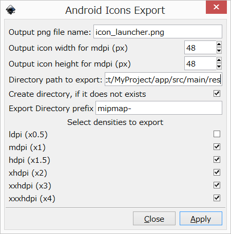
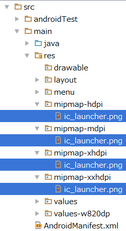

# inkscape-android-icons-export
This is a Inkscape extension which allows you to export various size of png file as Android icon.

## Install
Download `android_icons_export.inx` and `android_icons_export.py` and copy both files to the extension directory.

The extension directory is generally `<Inkscape install directory>/share/extensions`.  
If you use Linux or Mac, you can also use `$HOME/.config/inkscape/extensions`.

After that, you have to restart Inkscape.

## Usage
- Select `Extensions -> Export -> Android Icon Export…`
- Customize the settings  
  
- Click `Apply`
- Then you can find the png files in each directory.  
  
